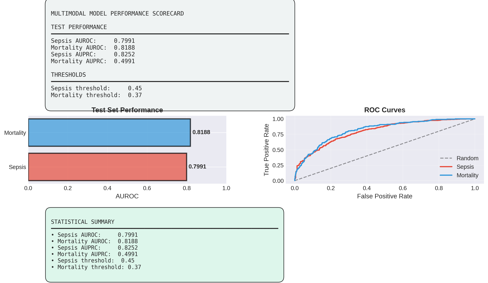
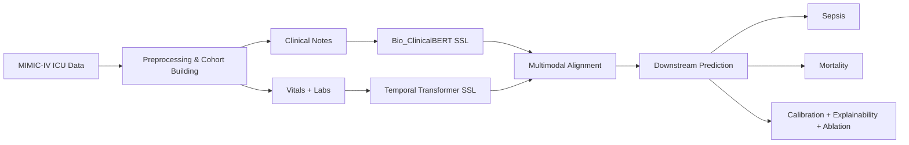

# PraOjas

**A self-supervised multimodal transformer for early sepsis and mortality risk prediction.**

PraOjas combines clinical text and structured time-series signals to learn patient representations that support early risk stratification, calibration analysis, explainability, and ablation-based evaluation.




## 🧠 Overview

PraOjas is a clinical machine learning project that learns from both free-text notes and ICU time-series to predict deterioration risk earlier than single-modality baselines. The project includes self-supervised pretraining, multimodal fusion, and a full evaluation pipeline with calibration and explainability.

## 🛠️ Tech Stack

- **Language:** Python
- **Deep learning:** PyTorch
- **NLP:** Hugging Face Transformers, Bio_ClinicalBERT
- **Classical ML / evaluation:** scikit-learn
- **Data processing:** pandas, NumPy, pyarrow
- **Visualization:** Matplotlib, Seaborn
- **Data source:** Google BigQuery / MIMIC-IV

## 🎯 Problem Statement

In ICU settings, the earliest signs of deterioration are often spread across two very different data sources:

- **Clinical notes** contain rich contextual information but are unstructured.
- **Vitals and labs** are dense, noisy, and irregularly sampled over time.

The challenge is to learn a robust self-supervised multimodal model that can fuse both sources and predict outcomes such as **sepsis** and **mortality** earlier and more reliably than a single-modality baseline.

## 💡 Proposed Solution

This project addresses the problem with a two-stage self-supervised pipeline:

1. **Text pretraining** using **Bio_ClinicalBERT** on discharge summaries to learn clinical language representations.
2. **Time-series pretraining** using a transformer encoder on first-24-hour vitals and labs.
3. **Multimodal alignment** to connect text and temporal representations through contrastive learning.
4. **Downstream evaluation** with k-fold cross-validation, statistical testing, calibration analysis, explainability, and ablation studies.

The final workflow is designed to be reproducible, modular, and easy to extend for additional clinical outcomes.

## 📌 Key Findings

- Multimodal learning improves performance over temporal-only baselines.
- The model produces usable risk scores with calibration analysis and error breakdowns.
- Clinical text pretraining and time-series pretraining are both saved as reusable artifacts.

## 🧩 Architecture



## 📊 Dataset

- **Primary source:** MIMIC-IV ICU data
- **Final multimodal dataset:** 7,492 patients
- **Splits:** 4,582 train, 1,513 validation, 1,397 test
- **Modalities:**
  - ICU vitals
  - Laboratory values
  - Discharge summaries / clinical notes

Additional pretraining artifacts were built from larger subsets of the source data:

- **Bio_ClinicalBERT SSL corpus:** 43,777 clinical notes samples
- **Time-series SSL corpus:** 54,551 ICU stays

> **Note:** MIMIC-IV is a restricted-access clinical dataset. Access requires credentialed approval and the appropriate PhysioNet data-use agreement.

## 📈 Results

### 🔍 Downstream performance

| Metric | Value |
|---|---:|
| Sepsis AUROC | 0.799 |
| Mortality AUROC | 0.819 |
| Sepsis ECE | 0.059 |
| Mortality ECE | 0.136 |

### 🧪 Additional evaluation outputs

- 5-fold cross-validation results and fold-wise AUROC gains
- Statistical significance testing with paired tests and bootstrap confidence intervals
- Error analysis by age and confidence bands
- Calibration curves and Brier/ECE metrics
- Explainability via permutation importance and integrated gradients
- 2-model and 5-model ablation studies

All plots and tables are saved in [`evaluation_results/`](evaluation_results/).

## 🗂️ Folder Structure

```text
.
├── README.md
├── Multimodal_Transformer_for_Mortality_Prediction_and_Sepsis_detection.ipynb
├── multimodal-transformer-ssl-for-early-mortality-s (1).ipynb
├── evaluation_results/
├── bio_clinical_ssl_trained/
├── timeseries_encoder_ssl/
├── dataset_info.json
├── phase3_complete_summary.json
├── train_cohort.parquet
├── val_cohort.parquet
├── test_cohort.parquet
├── train_24h.parquet
├── val_24h.parquet
├── test_24h.parquet
├── vitals_wide.parquet
├── labs_wide.parquet
└── notes_discharge.parquet
```

### 📁 Key folders

- [`evaluation_results/`](evaluation_results/) - figures, CSVs, calibration output, error analysis, ablations
- [`bio_clinical_ssl_trained/`](bio_clinical_ssl_trained/) - Bio_ClinicalBERT fine-tuning artifacts
- [`timeseries_encoder_ssl/`](timeseries_encoder_ssl/) - temporal encoder checkpoints and training results

## 📝 What Each Notebook Does

### `Multimodal_Transformer_for_Mortality_Prediction_and_Sepsis_detection.ipynb`

- Connects to BigQuery and extracts cohort data from MIMIC-IV
- Builds ICU cohort metadata and labels
- Preprocesses vitals, labs, and notes
- Saves cleaned datasets and summary artifacts for downstream training

### `multimodal-transformer-ssl-for-early-mortality-s (1).ipynb`

- Performs self-supervised training for clinical text and time-series signals
- Uses **Bio_ClinicalBERT** for clinical note representation
- Trains a temporal transformer encoder on vitals and labs
- Aligns modalities with contrastive learning
- Produces final checkpoints and training summaries

## ♻️ Reproducibility Notes

- The project is organized to survive notebook restarts by saving intermediate parquet files, JSON summaries, and model checkpoints.
- Evaluation outputs are persisted under `evaluation_results/` so the figures and metrics can be reused in reports, presentations, or GitHub README updates.
- If you re-run training, keep the same split files and checkpoint folders to preserve comparability.

## 🚀 How To Run

1. Open `Multimodal_Transformer_for_Mortality_Prediction_and_Sepsis_detection.ipynb` to reproduce the cohort extraction and preprocessing pipeline.
2. Open `multimodal-transformer-ssl-for-early-mortality-s (1).ipynb` to review the self-supervised training workflow.
3. Load the saved parquet files and checkpoints from the project folders if you want to inspect or extend the experiments.
4. Review `evaluation_results/` for the final plots, CSVs, and comparison tables.

## 🧾 Suggested Citation / Project Summary

**PraOjas** is a multimodal clinical machine learning project that combines self-supervised learning on discharge summaries and ICU time-series to predict sepsis and mortality, with emphasis on reproducibility, calibration, and interpretability.

## ✅ Key Deliverables

- Bio_ClinicalBERT fine-tuning checkpoint
- Temporal transformer encoder checkpoint
- Evaluation figures and CSVs
- Calibration and error analysis artifacts
- 2-model and 5-model ablation results

## ⚠️ Limitations

- This repository focuses on research and experimentation rather than a production API.
- The data is derived from MIMIC-IV and therefore cannot be freely redistributed.
- Performance can vary depending on cohort definition, split strategy, and preprocessing choices.

## 🔭 Future Work

- Add a lightweight inference pipeline for new ICU admissions.
- Compare Bio_ClinicalBERT against additional clinical language models.
- Extend the multimodal architecture with attention-based fusion and uncertainty estimation.
- Package the evaluation pipeline into a reproducible command-line workflow.

## 📍 Status

This project is research-complete for the current pipeline and includes training artifacts, evaluation outputs, and documentation-ready summaries.
